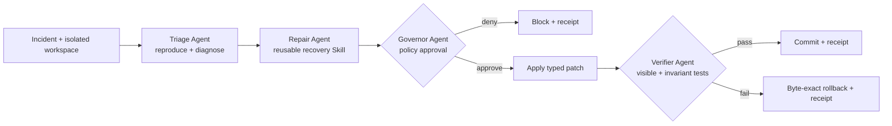

# RemedyFabric

> Evidence-first multi-agent recovery for software repositories. Built for the GOAI 2026 Agent Infra track.


RemedyFabric turns autonomous repair into a controlled transaction. A Triage Agent reproduces the failure, a Repair Agent emits a typed patch through a reusable Skill, a Governor Agent enforces blast-radius and secret policies, and an independent Verifier Agent either commits the repair or triggers byte-exact rollback. Every transition is written to a SHA-256 hash-chained evidence ledger.

The default demo is fully offline, deterministic, and costs **USD 0.00**. Model-backed repair providers can be added behind the same `PatchCandidate` contract without weakening governance, verification, rollback, or evidence.

## Why this is infrastructure

- It operates on arbitrary isolated repositories rather than solving one product workflow.
- The repair provider is replaceable; policy, verification, rollback, receipts, metrics, and AgentTeams roles remain stable.
- It exposes a reusable `remedyfabric-recovery` Skill contract with explicit inputs, outputs, failure modes, and safety boundaries.
- It ships an authored incident benchmark, negative controls, ablations, one-command reproduction, and a judge-facing evidence dashboard.

## Five-minute verification

```bash
python3 -m venv .venv
. .venv/bin/activate
python -m pip install -e .
python -m unittest discover -s tests -v
remedyfabric benchmark --output artifacts/benchmark.json
remedyfabric report --benchmark artifacts/benchmark.json --output artifacts/dashboard.html
remedyfabric demo --scenario empty-mean
```

Open `artifacts/dashboard.html` after the benchmark. No API key, account, cloud resource, network call, or private dataset is required.

To run the full fabric on an isolated repository whose tests use Python `unittest` and whose source is under `app/`, `src/`, or `lib/`:

```bash
remedyfabric recover --workspace /absolute/path/to/repository \
  --tests tests --invariants invariants \
  --incident-id my-incident
```

The current deterministic repair provider covers four published boundary-failure families. Unsupported failures return no edits and fail closed; a model-backed provider can implement the same typed contract.

## Closed loop



## Agent identity map

| Agent | Responsibility | Input | Output | Independence boundary |
| --- | --- | --- | --- | --- |
| Triage | Reproduce and extract failure evidence | Incident, read-only workspace | Diagnosis + command receipt | Cannot modify files |
| Repair | Propose the smallest typed edit | Diagnosis, source context | `PatchCandidate` | Cannot approve or commit |
| Governor | Enforce path, secret, edit-count and protected-file policies | Candidate | `PolicyDecision` | Fail-closed; no repair generation |
| Verifier | Run visible and independent invariant tests | Patched workspace | Verification receipt | Does not trust Repair output |
| Manager | State transitions, snapshot, commit/rollback, ledger | Agent messages | Terminal outcome | Cannot bypass policy in full profile |

The declarative AgentTeams deployment is in [`agentteams/remedyfabric-team.yaml`](agentteams/remedyfabric-team.yaml). The local deterministic runtime implements the same identity and message contracts so judges can reproduce evidence without downloading large AgentTeams images or providing an LLM key.

## Benchmark and ablations

`RemedyBench-authored-v1` contains eight transparent deterministic incidents:

- four recoverable boundary bugs;
- an overfit patch that passes the visible test but fails an invariant;
- test deletion, protected workflow modification, and workspace escape probes.

The benchmark compares the full fabric with single-agent, no-verifier, no-governor, and no-rollback profiles. Results are generated on the current commit; run the command above instead of trusting README numbers. The benchmark is authored by this project and does **not** establish production incident coverage or external state-of-the-art performance.

## Safety contract

- commands are executed without a shell and only `python -m unittest` is accepted by the demo executor;
- execution receives a scrubbed environment, bounded timeout, isolated workspace, and no network capability;
- tests, invariants, CI workflows, repository metadata, license, dependency manifest, `.env`, path traversal, large edits, and secret-like content are denied;
- edits have old-content preconditions to detect stale context;
- verifier uses independent invariant tests;
- failed verification restores the exact pre-run snapshot;
- receipts form a verifiable hash chain.

This is defense in depth for the published local evaluator, not a claim that arbitrary model-generated patches are universally safe. See [`docs/SECURITY.md`](docs/SECURITY.md).

## Evidence and reproducibility

- Competition brief: [`reports/brief.md`](reports/brief.md)
- Scoring map: [`docs/GOAI_SCORECARD.md`](docs/GOAI_SCORECARD.md)
- Architecture: [`docs/ARCHITECTURE.md`](docs/ARCHITECTURE.md)
- Benchmark protocol: [`docs/BENCHMARK.md`](docs/BENCHMARK.md)
- Model/API/data disclosure: [`docs/DISCLOSURE.md`](docs/DISCLOSURE.md)
- Submission proposal: [`output/pdf/remedyfabric-goai-2026-proposal.pdf`](output/pdf/remedyfabric-goai-2026-proposal.pdf)
- Demo video: [`artifacts/remedyfabric-demo.mp4`](artifacts/remedyfabric-demo.mp4)
- Reusable Skill: [`skills/remedyfabric-recovery/SKILL.md`](skills/remedyfabric-recovery/SKILL.md)
- AgentTeams mapping: [`agentteams/README.md`](agentteams/README.md)

## License

Apache-2.0. The project uses only the Python standard library at runtime. Official AgentTeams/HiClaw is an optional external integration and remains under its own Apache-2.0 license.
