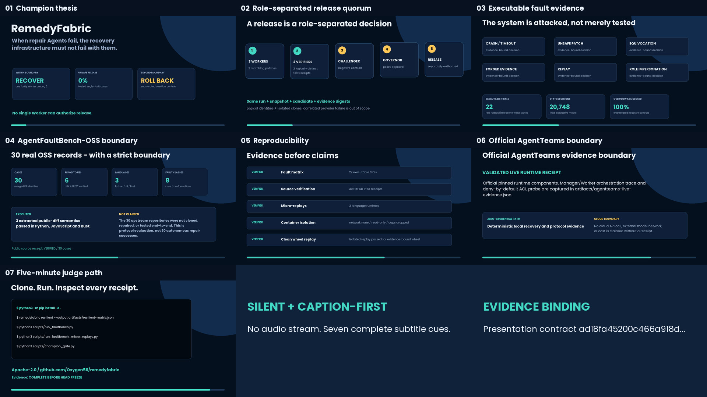
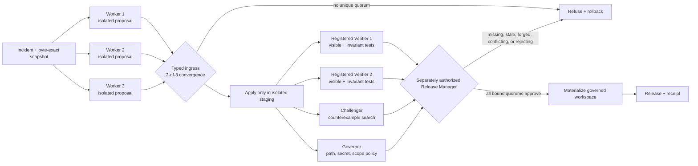

# RemedyFabric

> Faulty-worker-resistant multi-agent recovery for software repositories. Built for the GOAI 2026 Agent Infra track.



Most autonomous repair systems protect a repository from a bad patch while
quietly assuming that the repair Agents themselves are trustworthy.
**RemedyFabric tests the opposite assumption.** When one repair Worker crashes,
equivocates, replays stale context, impersonates another role, times out, forges
a proposal, or sends an unsafe patch, the remaining Workers can still recover.
When an enumerated boundary case is exceeded, the system refuses release and
retains or restores the captured pre-change bytes.

This is infrastructure, not a thin model wrapper. The repair provider is
replaceable; the durable product is the transaction protocol: role-separated
proposals, scoped authority, evidence-bound verification, adversarial
challenge, policy governance, release quorum, rollback, and machine-checkable
receipts.

## The result in one table

| Evidence layer | Executed result | What it establishes | What it does not establish |
| --- | --- | --- | --- |
| Resilient runtime | **22** fresh isolated repository executions | Across **8** one-Worker fault modes: **100% recovery**, **0 unsafe releases**; across **13** overflow/control trials: **100% fail closed**, **0 pre-authorization workspace writes**, **0 external-byte violations** | Arbitrary repositories, arbitrary faults, or production reliability |
| Finite-state checker | **20,748** decisions exhaustively checked; zero counterexamples for six release-safety properties | Safety inside the published small model | General BFT, cryptographic identity, or a formal production proof |
| AgentFaultBench-OSS | **30** provenance-bound cases (**23** one-Worker + **7** overflow/control), 6 public repositories, 3 languages, 8 synthetic fault classes; 120 profile trials | Real `CandidateProposal`, `Attestation`, and `QuorumGate` protocol behavior across fixed topologies | Full upstream checkout, autonomous patch generation, or upstream test execution |
| Semantic micro-replays | **3** real executions in Python, JavaScript, and Rust | One extracted before/after semantic from each linked public diff really executes | Complete Requests, Fastify, or axum reproduction |
| Container boundary probe | Network, root-filesystem write, and host-secret probes denied in one recorded Docker run | The published verifier boundary was active in that run | A complete hostile-code sandbox or a production deployment |
| Official AgentTeams live path | **Conditional on strict receipt validation** | A valid `agentteams-live-evidence.json` binds official v1.2.2 Controller + Manager + 8 Worker containers, an adapter-assisted/operator-captured Matrix typed protocol, real Skill/control executions, and the terminal quorum decision | LLM-autonomous orchestration, independent failure domains, or a cloud run |
| Frozen-release proof | **Pending until the frozen HEAD finishes public CI and the release bundle validates** | Four HEAD-bound receipts—`clean-replay.json`, `public-ci.json`, `champion-evidence.json`, and `champion-gate.json`—bind the exact commit, replay archives, public workflow, evidence manifest, and final gate | A same-named local file, an earlier receipt, or source text cannot establish final readiness |

Raw evidence is retained in [`artifacts/resilient-matrix.json`](artifacts/resilient-matrix.json),
[`artifacts/quorum-model.json`](artifacts/quorum-model.json),
[`artifacts/faultbench-results.json`](artifacts/faultbench-results.json),
[`artifacts/faultbench-micro-replays.json`](artifacts/faultbench-micro-replays.json), and
[`artifacts/container-isolation.json`](artifacts/container-isolation.json).

**Freeze status:** the deterministic 22-trial mechanism gate passes. The official
AgentTeams result counts only when `artifacts/agentteams-live-evidence.json`
exists and passes the strict validator. The four frozen-release receipts are
intentionally generated only after the source HEAD exists: tracking them in that
HEAD would invalidate the commit or evidence bindings they certify. Their
authoritative copies must be read from the public v0.2.0 release ZIP; the clean
replay must also trace to the exact public CI artifact for that HEAD. If either
public carrier is unavailable, any receipt is missing, or strict validation
fails, final release status remains **pending**. A source checkout or stale local
file is not authority.

## Five-minute judge route

The champion mechanism has no model, account, dataset, or network dependency.
From the repository root, Python 3.11+ is enough:

```bash
PYTHONPATH=src python3 scripts/run_resilient_matrix.py \
  --output /tmp/remedyfabric-resilient.json
PYTHONPATH=src python3 scripts/check_quorum_model.py \
  --output /tmp/remedyfabric-quorum-model.json
PYTHONPATH=src python3 scripts/run_faultbench.py \
  --output /tmp/remedyfabric-faultbench.json
```

The first command creates real temporary repository workspaces, applies each
candidate only to an isolated staging copy before authorization, runs visible
and invariant tests, and materializes the governed workspace only after the
bound quorum approves. Denied trials leave the governed baseline untouched; an
authorized materialization failure is restored from the captured snapshot. It
exits non-zero if any mechanism threshold fails. The next two commands reproduce
the finite-state and protocol-simulation layers. A guided inspection with exact
expected fields is in
[`docs/JUDGE_GUIDE.md`](docs/JUDGE_GUIDE.md).

For the original four-Agent authored incident demo:

```bash
python3 -m venv .venv
.venv/bin/python3 -m pip install -e .
.venv/bin/remedyfabric demo --scenario empty-mean
```

## How the champion protocol works



A release requires all of the following, bound to the same run ID, candidate
digest, and pre-change snapshot digest:

- two distinct registered Workers converging on the same executable patch;
- two distinct registered Verifier approvals from real visible and invariant tests;
- one Challenger approval from invariant and patch-materialization checks;
- one Governor approval from the fail-closed source-change policy; and
- a request by the separately registered Release Manager.

Duplicate identities do not increase quorum. A Worker cannot vote as a
Verifier, Governor, Challenger, or Release Manager. SHA-256 binds content and
context; it is not presented as an actor signature.

## The standout failure demonstration

The unsafe-Worker probe is not a label lookup. A faulty Worker emits an overfit
patch that changes `mean(values)` to always return zero. That patch satisfies the
narrow empty-input test but breaks preserved non-empty behavior.

- With one faulty Worker, two other role-distinct Workers converge on the correct patch
  and recovery proceeds.
- In the enumerated two-Worker collusion trial, the unsafe patch reaches proposal
  quorum and is materially applied and tested in an isolated staging copy, never
  in the governed workspace.
- Both Verifiers and the Challenger execute the invariant, reject the candidate,
  and the Release Manager retains the byte-exact governed baseline.

See [`docs/RESILIENT_RUNTIME.md`](docs/RESILIENT_RUNTIME.md) and the per-trial
raw decisions in [`artifacts/resilient-matrix.json`](artifacts/resilient-matrix.json).

## Evidence beyond the authored fixture

AgentFaultBench-OSS links 30 merged defect-fix PR identities across Flask,
Requests, Express, Fastify, ripgrep, and axum. GitHub's official REST API was
used read-only to revalidate stored PR, merge-commit, issue-link, and repository
license metadata; all 30 records passed at the recorded retrieval time.

The 30 cases are explicitly a **protocol-simulation corpus**. They transform
provenance-bound records into real proposal and attestation messages and compare
single-agent, simple-majority, v0.1, and champion-quorum topologies. They do not
claim to clone, repair, build, or test all 30 upstream repositories. Three
separate, independently written micro-replays execute only an extracted semantic
from Requests, Fastify, and axum public diffs. See
[`docs/AGENTFAULTBENCH.md`](docs/AGENTFAULTBENCH.md).

## AgentTeams and Skill integration status

The reusable [`remedyfabric-recovery` Skill](skills/remedyfabric-recovery/SKILL.md)
defines typed inputs, outputs, preconditions, failure modes, and the provider
replacement boundary. AgentTeams manifests map the protocol to named Workers
and explicit capability restrictions:

- [`agentteams/remedyfabric-team.yaml`](agentteams/remedyfabric-team.yaml): portable manifest;
- [`agentteams/remedyfabric-live-local.yaml`](agentteams/remedyfabric-live-local.yaml): local-live design with role-separated proposers, Verifiers, Challenger, Governor, leader, and Release Manager;
- [`agentteams/official-alibaba-cloud-skill.lock.json`](agentteams/official-alibaba-cloud-skill.lock.json): pinned metadata for an official Alibaba Cloud discovery Skill, not vendored and not invoked against cloud APIs.

**Conditional official-live result:** only a present, strict-validator-passing
`artifacts/agentteams-live-evidence.json`
establishes the official AgentTeams v1.2.2 Controller, Manager, and eight Worker
containers; an adapter-assisted, operator-captured Matrix typed protocol; two
proposers actually executing `remedyfabric-recovery`; two Verifiers, the lead
reviewer, Challenger, Governor, and Release Manager executing their bound role
helpers; and the Release Manager actually invoking `QuorumGate`. This is an
operator-assisted execution record, not a claim that an LLM autonomously
orchestrated the entire workflow. If that artifact is absent or invalid, none of
those successful-loop claims is made and the older blocked receipt remains
historical diagnostics only.

The same strict receipt binds the local Ollama `gpt-oss:20b` model
(`17052f91a42e97930aa6e28a6c6c06a983e6a58dbb00434885a0cf5313e376f7`,
20.9B, MXFP4, Apache-2.0), USD 0.00 model/API fees, and local compute. The
official Alibaba Cloud Skill is pinned and package-verified; the captured path
executes only a no-credential preflight through the adapter, sends no cloud
query, and incurs no cloud/API cost. The deterministic runtime remains the
verified zero-credential reproduction path regardless of live-receipt status.

## Security boundary

Within the published executable model, one of three registered Workers may
crash, equivocate, forge or replay a proposal, submit an unsafe patch, use stale
context, impersonate a role, or time out. Membership and role registration plus
the role-separated control plane are trusted. The 13 overflow/control trials are
specific tested cases, not a guarantee for every multi-fault combination.

The deterministic Workers and Verifiers are logically distinct identities using
separate repository clones, but they share one Python implementation and the
same deterministic provider. Correlated implementation/provider failure is not
claimed as an independent fault domain.

Path traversal, absolute paths, symlink segments, duplicate edits and stale
multi-edit inputs are fail-closed in the tested static workspaces. The result
does not claim protection against another local process racing a directory/file
replacement during the authorization window; production use needs exclusive
isolation or locking and descriptor-based beneath/no-follow file operations.
Rollback equality covers ordinary files captured by `WorkspaceSnapshot`; `.git`
is excluded from the snapshot and separately denied as a candidate edit root.

This project does **not** claim general Byzantine fault tolerance, authenticated
distributed consensus, arbitrary-code containment, production deployment
safety, or universal repair correctness. Read the full
[`security threat model`](docs/SECURITY_THREAT_MODEL.md) before adapting it to a
real repository.

## Evidence index

- Judge route and evidence hierarchy: [`docs/JUDGE_GUIDE.md`](docs/JUDGE_GUIDE.md)
- GOAI score mapping: [`docs/GOAI_SCORECARD.md`](docs/GOAI_SCORECARD.md)
- Fault-tolerance protocol: [`docs/FAULT_TOLERANCE.md`](docs/FAULT_TOLERANCE.md)
- Executable resilience matrix: [`docs/RESILIENT_RUNTIME.md`](docs/RESILIENT_RUNTIME.md)
- AgentFaultBench-OSS protocol corpus: [`docs/AGENTFAULTBENCH.md`](docs/AGENTFAULTBENCH.md)
- Architecture: [`docs/ARCHITECTURE.md`](docs/ARCHITECTURE.md)
- Authored incident benchmark: [`docs/BENCHMARK.md`](docs/BENCHMARK.md)
- Container boundary: [`docs/CONTAINER_ISOLATION.md`](docs/CONTAINER_ISOLATION.md)
- Frozen-release proof: inspect the four HEAD-bound receipts inside the public
  v0.2.0 release ZIP; verify the clean replay against the exact public CI
  artifact named for the frozen commit. These post-HEAD files are not
  source-tree evidence, and absence means pending.
- Model/API/data/tool disclosure: [`docs/DISCLOSURE.md`](docs/DISCLOSURE.md)
- Champion proposal PDF: [`output/pdf/remedyfabric-goai-agent-infra-champion.pdf`](output/pdf/remedyfabric-goai-agent-infra-champion.pdf)
- Champion demo video: [`artifacts/remedyfabric-champion-demo.mp4`](artifacts/remedyfabric-champion-demo.mp4)

## License and cost

RemedyFabric is Apache-2.0. The deterministic core uses only the Python standard
library and its retained runs cost **USD 0.00 in model/API fees**. Public GitHub
metadata verification uses read-only public endpoints. Optional AgentTeams,
models, Alibaba Cloud resources, video tooling, and developer tools keep their
own licenses and billing terms; none is hidden inside the offline result. See
[`docs/DISCLOSURE.md`](docs/DISCLOSURE.md) for the complete ledger.
